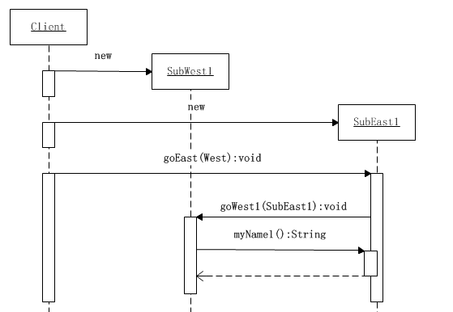

# 1.2 两大核心

## 1. JMM的介绍

出现线程安全的问题一般是因为**主内存和工作内存数据不一致性**和**重排序**导致的，而解决线程安全的问题最重要的就是理解这两种问题是怎么来的，那么，理解它们的核心在于理解java内存模型（JMM）。

在多线程条件下，多个线程肯定会相互协作完成一件事情，一般来说就会涉及到**多个线程间相互通信告知彼此的状态以及当前的执行结果**等，另外，为了性能优化，还会**涉及到编译器指令重排序和处理器指令重排序**。

## 2. 内存模型抽象结构

         在并发编程中主要需要解决两个问题：**1. 线程之间如何通信；2.线程之间如何完成同步**（这里的线程指的是并发执行的活动实体）。通信是指线程之间以何种机制来交换信息，主要有两种：**共享内存**和**消息传递**。java内存模型是**共享内存的并发模型**，线程之间主要通过读-写共享变量来完成隐式通信。

###  2.1 哪些是共享变量

        java程序中所有**实例域，静态域和数组元素。**

###  2.2 JMM抽象结构模型

       共享变量会先放在主存中，每个线程都有属于自己的工作内存，并且会把位于主存中的共享变量拷贝到自己的工作内存，之后的读写操作均使用位于工作内存的变量副本，并在某个时刻将工作内存的变量副本写回到主存中去。

线程A和线程B之间要完成通信的话，要经历如下两步：

1. 线程A从主内存中将共享变量读入线程A的工作内存后并进行操作，之后将数据重新写回到主内存中；
2. 线程B从主存中读取最新的共享变量。

## 3. 重排序

在不改变程序执行结果的前提下，尽可能提高并行度。JMM对底层尽量减少约束，使其能够发挥自身优势。因此，在执行程序时，**为了提高性能，编译器和处理器常常会对指令进行重排序**。一般重排序可以分为如下三种：从源码到最终执行的指令序列的示意图

1. 编译器优化的重排序。编译器在不改变单线程程序语义的前提下，可以重新安排语句的执行顺序；
2. 指令级并行的重排序。现代处理器采用了指令级并行技术来将多条指令重叠执行。如果**不存在数据依赖性**，处理器可以改变语句对应机器指令的执行顺序；
3. 内存系统的重排序。由于处理器使用缓存和读/写缓冲区，这使得加载和存储操作看上去可能是在乱序执行的。

如图，1属于编译器重排序，而2和3统称为处理器重排序。这些重排序会导致线程安全的问题，一个很经典的例子就是DCL问题，这个在以后的文章中会具体去聊。

**针对编译器重排序**，JMM的编译器重排序规则会禁止一些**特定类型的编译器重排序**；

**针对处理器重排序**，编译器在生成指令序列的时候会通过**插入内存屏障指令来禁止某些特殊的处理器重排序**。

**如果两个操作访问同一个变量，且这两个操作有一个为写操作，此时这两个操作就存在数据依赖性**这里就存在三种情况：1. 读后写；2.写后写；3. 写后读，者三种操作都是存在数据依赖性的，如果重排序会对最终执行结果会存在影响。**编译器和处理器在重排序时，会遵守数据依赖性，编译器和处理器不会改变存在数据依赖性关系的两个操作的执行顺序**  
  
 **遵守as-if-serial语义的编译器，runtime和处理器共同为编写单线程程序的程序员创建了一个幻觉：单线程程序是按程序的顺序来执行的**。

## 4. happens-before规则

     JMM为程序员在上层提供了六条规则，这样我们就可以根据规则去推论跨线程的内存可见性问题，而不用再去理解底层重排序的规则。

### 4.1 happens-before定义

具体的定义为：

1）如果一个操作**happens-before**另一个操作，那么第一个操作的执行结果将对第二个操作**可见**，而且第一个操作的执行顺序排在第二个操作之前。

2）两个操作之间存在**happens-before**关系，并不意味着Java平台的具体实现**必须要按照happens-before关系指定的顺序来执行**。如果重排序之后的执行结果，与按happens-before关系来执行的结果一致，那么这种重排序并不非法（也就是说，JMM允许这种重排序）。  
 

**1）是JMM对程序员的承诺**。  
 **2）是JMM对编译器和处理器重排序的约束原则**。

### 4.2  **as-if-serial VS happens-before**

         happens-before关系本质上和as-if-serial语义是一回事。

1. as-if-serial语义保证**单线程内程序的执行结果不被改变**，happens-before关系保证**正确同步的多线程程序的执行结果不被改变**。
2. as-if-serial语义给编写单线程程序的程序员创造了一个幻境：**单线程程序是按程序的顺序来执行的**。happens-before关系给编写正确同步的多线程程序的程序员创造了一个幻境：**正确同步的多线程程序是按happens-before指定的顺序来执行的**。
3. as-if-serial语义和happens-before这么做的目的，都是为了在**不改变程序执行结果的前提下，尽可能地提高程序执行的并行度**。

### 4.3 具体规则

1. **程序顺序**规则：**一个线程**中的每个操作，happens-before于该线程中的任意后续操作
2. **监视器锁**规则：对**一个锁**的解锁，happens-before于随后对这个锁的**加锁**。
3. **volatile变量**规则：对一个volatile域的写，happens-before于任意后续对这个volatile域的读。
4. **传递性**：如果A happens-before B，且B happens-before C，那么A happens-before C。
5. **start\(\)规则**：如果线程A执行操作ThreadB.start\(\)（启动线程B），那么A线程的ThreadB.start\(\)操作happens-before于线程B中的任意操作。
6. **join\(\)规则**：如果线程A执行操作ThreadB.join\(\)并成功返回，那么线程B中的任意操作happens-before于线程A从ThreadB.join\(\)操作成功返回。
7. **程序中断规则**：对线程interrupted\(\)方法的调用先行于被中断线程的代码检测到中断时间的发生。
8. **对象finalize规则**：一个对象的**初始化完成**（构造函数执行结束）**先行于**发生它的**finalize\(\)方法**的开始。

## 5.总结

### 5.1 JMM的设计

在设计JMM时需要考虑两个关键因素:

1.  **程序员对内存模型的使用**  程序员希望内存模型易于理解、易于编程。程序员希望基于一个强内存模型来编写代码。
2.  **编译器和处理器对内存模型的实现**  编译器和处理器希望内存模型对它们的束缚越少越好，这样它们就可以做尽可能多的优化来提高性能。编译器和处理器希望实现一个弱内存模型。

### 5.2 happens-before与JMM的关系

 一个happens-before规则对应于一个或多个编译器和处理器重排序规则。

### 5.3 今后可能需要关注的问题

 从上面内存抽象结构来说，可能出在数据“脏读”的现象，这就是**数据可见性**的问题，

另外，重排序在多线程中不注意的话也容易存在一些问题，比如一个很经典的问题就是DCL（双重检验锁），这就是需要**禁止重排序**，

另外，在**多线程下原子操作**例如i++不加以注意的也容易出现线程安全的问题。

