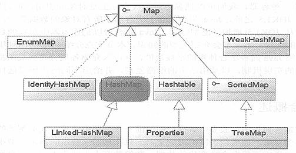

# Java集合框架

### 概念汇总：

         Java的集合类主要由两个接口派生而出：**Collection**和**Map:**

        **Collection:**

           **Map:**

1. List集合是**有序集合**，集合中的元素**可以重复**，通过元素的**索引**访问**；**
2. Set集合是**无序集合**，集合中的元素**不可以重复**，访问集合中的元素只能根据元素本身来访问（也是不能集合里元素不允许重复的原因）。
3. Map集合中保存**Key-value对**形式的元素，通过元素的**key**来访问其value。

