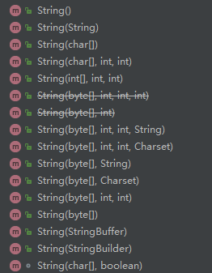

# 1.2 String源码

### 1. 类间关系：

         String类**被final所修饰**，也就是说**String对象是不可变量**，便于并发。String类实现了Serializable,  Comparable,  CharSequence接口。

```java
public final class String
        implements java.io.Serializable, Comparable<String>, CharSequence{
```

          Comparable接口有compareTo\(String s\)方法，CharSequence接口有length\(\)，charAt\(int index\)，subSequence\(int start,int end\)方法。

### 2. 属性：

         String类中包含一个**不可变的char数组**用来存放字符串，一个int型的变量hash用来存放计算后的哈希值。

```java
/** The value is used for character storage. */
    private final char value[];

    /** Cache the hash code for the string */
    private int hash; // Default to 0
```

### 3. 构造函数：



```java
//不含参数的构造函数，一般没什么用，因为value是不可变量
  public String() {
        this.value = "".value;
    }

 public String(String original) {
        this.value = original.value;
        this.hash = original.hash;
    }

  public String(char value[]) {
        this.value = Arrays.copyOf(value, value.length);
    }

    
  public String(char value[], int offset, int count) {
        if (offset < 0) {
            throw new StringIndexOutOfBoundsException(offset);
        }
        if (count <= 0) {
            if (count < 0) {
                throw new StringIndexOutOfBoundsException(count);
            }
            if (offset <= value.length) {
                this.value = "".value;
                return;
            }
        }
        // Note: offset or count might be near -1>>>1.
        if (offset > value.length - count) {
            throw new StringIndexOutOfBoundsException(offset + count);
        }
        this.value = Arrays.copyOfRange(value, offset, offset+count);
    }

    
  public String(int[] codePoints, int offset, int count) {
        if (offset < 0) {
            throw new StringIndexOutOfBoundsException(offset);
        }
        if (count <= 0) {
            if (count < 0) {
                throw new StringIndexOutOfBoundsException(count);
            }
            if (offset <= codePoints.length) {
                this.value = "".value;
                return;
            }
        }
        // Note: offset or count might be near -1>>>1.
        if (offset > codePoints.length - count) {
            throw new StringIndexOutOfBoundsException(offset + count);
        }

        final int end = offset + count;

        // Pass 1: Compute precise size of char[]
        int n = count;
        for (int i = offset; i < end; i++) {
            int c = codePoints[i];
            if (Character.isBmpCodePoint(c))
                continue;
            else if (Character.isValidCodePoint(c))
                n++;
            else throw new IllegalArgumentException(Integer.toString(c));
        }

        // Pass 2: Allocate and fill in char[]
        final char[] v = new char[n];

        for (int i = offset, j = 0; i < end; i++, j++) {
            int c = codePoints[i];
            if (Character.isBmpCodePoint(c))
                v[j] = (char)c;
            else
                Character.toSurrogates(c, v, j++);
        }

        this.value = v;
    }

    
    @Deprecated
  public String(byte ascii[], int hibyte, int offset, int count) {
        checkBounds(ascii, offset, count);
        char value[] = new char[count];

        if (hibyte == 0) {
            for (int i = count; i-- > 0;) {
                value[i] = (char)(ascii[i + offset] & 0xff);
            }
        } else {
            hibyte <<= 8;
            for (int i = count; i-- > 0;) {
                value[i] = (char)(hibyte | (ascii[i + offset] & 0xff));
            }
        }
        this.value = value;
    }

    
    @Deprecated
  public String(byte ascii[], int hibyte) {
        this(ascii, hibyte, 0, ascii.length);
    }

    
  public String(byte bytes[], int offset, int length, String charsetName)
            throws UnsupportedEncodingException {
        if (charsetName == null)
            throw new NullPointerException("charsetName");
        checkBounds(bytes, offset, length);
        this.value = StringCoding.decode(charsetName, bytes, offset, length);
    }

    
  public String(byte bytes[], int offset, int length, Charset charset) {
        if (charset == null)
            throw new NullPointerException("charset");
        checkBounds(bytes, offset, length);
        this.value =  StringCoding.decode(charset, bytes, offset, length);
    }

    
    public String(byte bytes[], String charsetName)
            throws UnsupportedEncodingException {
        this(bytes, 0, bytes.length, charsetName);
    }

    
    public String(byte bytes[], Charset charset) {
        this(bytes, 0, bytes.length, charset);
    }

    
    public String(byte bytes[], int offset, int length) {
        checkBounds(bytes, offset, length);
        this.value = StringCoding.decode(bytes, offset, length);
    }

    
    public String(byte bytes[]) {
        this(bytes, 0, bytes.length);
    }

    
    public String(StringBuffer buffer) {
        synchronized(buffer) {
            this.value = Arrays.copyOf(buffer.getValue(), buffer.length());
        }
    }

    
    public String(StringBuilder builder) {
        this.value = Arrays.copyOf(builder.getValue(), builder.length());
    }

    
    String(char[] value, boolean share) {
        // assert share : "unshared not supported";
        this.value = value;
    }
```

### 4. 常用方法：

#### 1）基础方法：

```java
    public String toString() {
        return this;
    }
    
    public int length() {
        return value.length;
    }

    
    public boolean isEmpty() {
        return value.length == 0;
    }

    
    public char charAt(int index) {
        if ((index < 0) || (index >= value.length)) {
            throw new StringIndexOutOfBoundsException(index);
        }
        return value[index];
    }
    
    
     public boolean contains(CharSequence s) {
        return indexOf(s.toString()) > -1;
    }
```

#### 2）equals\(\)、CompareTo\(\) 和 hashCode（）

```java
    public boolean equals(Object anObject) {
        if (this == anObject) {
            return true;
        }
        if (anObject instanceof String) {
            String anotherString = (String)anObject;
            int n = value.length;
            if (n == anotherString.value.length) {
                char v1[] = value;
                char v2[] = anotherString.value;
                int i = 0;
                while (n-- != 0) {
                    if (v1[i] != v2[i])
                        return false;
                    i++;
                }
                return true;
            }
        }
        return false;
    }   
```

 equals\(\) 判断规则：

1. **内存地址**相同，则为真。
2. 如果**对象类型**不是String类型，则为假。否则继续判断。
3. 如果对象**长度**不相等，则为假。否则继续判断。
4. **从后往前**，判断String类中char数组value的单个字符是否相等，有不相等则为假。如果一直相等直到第一个数，则返回真。

```java
public int compareTo(String anotherString) {
        //自身对象字符串长度len1
        int len1 = value.length;
        //被比较对象字符串长度len2
        int len2 = anotherString.value.length;
        //取两个字符串长度的最小值lim
        int lim = Math.min(len1, len2);
        char v1[] = value;
        char v2[] = anotherString.value;

        int k = 0;
        //从value的第一个字符开始到最小长度lim处为止，
        //如果字符不相等，返回自身（对象不相等处字符-被比较对象不相等字符）
        while (k < lim) {
            char c1 = v1[k];
            char c2 = v2[k];
            if (c1 != c2) {
                return c1 - c2;
            }
            k++;
        }
        //如果前面都相等，则返回（自身长度-被比较对象长度）
        return len1 - len2;
    }
```

CompareTo\(\) \(大小比较 \)判断规则：

1.  从value的第一个字符开始到最小长度lim处为止，如果字符不相等，返回自身（对象**不相等处字符**-被比较对象**不相等字符**）；
2.  如果前面都相等，则返回（自身长度-被比较对象长度）
3.  含义：1. 先从0开始判断字符大小，直到第一个不等的字符，返回差值；2.如果两个对象能比较字符的地方比较完了还相等，就直接返回自身长度减被比较对象长度；3. 如果两个字符串长度相等，则返回的是0，巧妙地判断了三种情况。

```java
public int hashCode() {
        int h = hash;
        //如果hash没有被计算过，并且字符串不为空，则进行hashCode计算
        if (h == 0 && value.length > 0) {
            char val[] = value;
          //下式含义：
          //val[0]*31^(n-1) + val[1]*31^(n-2) + ... + val[n-1]
            for (int i = 0; i < value.length; i++) {
                h = 31 * h + val[i];
            }
            hash = h;
        }
        return h;
    }
```

      String类的hash采用多项式计算得来，我们完全可以通过不相同的字符串得出同样的hash，所以**两个String对象的hashCode相同，并不代表两个String是一样的**。

#### 3）concat\(\)、replace\(\)、trim\(\)、split\(\)

```java
public String concat(String str) {
        int otherLen = str.length();
        //如果被添加的字符串为空，返回对象本身
        if (otherLen == 0) {
            return this;
        }
        int len = value.length;
        char buf[] = Arrays.copyOf(value, len + otherLen);
        str.getChars(buf, len);
        return new String(buf, true);
    }
```

```java
public String replace(char oldChar, char newChar) {
            //新旧值先对比
        if (oldChar != newChar) {
            int len = value.length;
            int i = -1;
            char[] val = value; 
            //找到旧值最开始出现的位置
            while (++i < len) {
                if (val[i] == oldChar) {
                    break;
                }
            }
             //从那个位置开始，直到末尾，用新值代替出现的旧值
            if (i < len) {
                char buf[] = new char[len];
                for (int j = 0; j < i; j++) {
                    buf[j] = val[j];
                }
                while (i < len) {
                    char c = val[i];
                    buf[i] = (c == oldChar) ? newChar : c;
                    i++;
                }
                return new String(buf, true);
            }
        }
        return this;
    }
```

```java
public String trim() {
        int len = value.length;
        int st = 0;
        char[] val = value;    
        //找到字符串前段没有空格的位置
        while ((st < len) && (val[st] <= ' ')) {
            st++;
        }
        //找到字符串末尾没有空格的位置
        while ((st < len) && (val[len - 1] <= ' ')) {
            len--;
        }
        //如果前后都没有出现空格，返回字符串本身
        return ((st > 0) || (len < value.length)) ? substring(st, len) : this;
    }
```

```java
public String[] split(String regex, int limit) {
        
        char ch = 0;
        if (((regex.value.length == 1 &&
                ".$|()[{^?*+\\".indexOf(ch = regex.charAt(0)) == -1) ||
                (regex.length() == 2 &&
                        regex.charAt(0) == '\\' &&
                        (((ch = regex.charAt(1))-'0')|('9'-ch)) < 0 &&
                        ((ch-'a')|('z'-ch)) < 0 &&
                        ((ch-'A')|('Z'-ch)) < 0)) &&
                (ch < Character.MIN_HIGH_SURROGATE ||
                        ch > Character.MAX_LOW_SURROGATE))
        {
            int off = 0;
            int next = 0;
            boolean limited = limit > 0;
            ArrayList<String> list = new ArrayList<>();
            while ((next = indexOf(ch, off)) != -1) {
                if (!limited || list.size() < limit - 1) {
                    list.add(substring(off, next));
                    off = next + 1;
                } else {    // last one
                    //assert (list.size() == limit - 1);
                    list.add(substring(off, value.length));
                    off = value.length;
                    break;
                }
            }
            // If no match was found, return this
            if (off == 0)
                return new String[]{this};

            // Add remaining segment
            if (!limited || list.size() < limit)
                list.add(substring(off, value.length));

            // Construct result
            int resultSize = list.size();
            if (limit == 0) {
                while (resultSize > 0 && list.get(resultSize - 1).length() == 0) {
                    resultSize--;
                }
            }
            String[] result = new String[resultSize];
            return list.subList(0, resultSize).toArray(result);
        }
        return Pattern.compile(regex).split(this, limit);
    }
```

####  4\) intern\(\)、valueof\(\)

```java
  public native String intern();
```

```java
public static String valueOf(boolean b) {
    return b ? "true" : "false";
}


public static String valueOf(char c) {
    char data[] = {c};
    return new String(data, true);
}


public static String valueOf(int i) {
    return Integer.toString(i);
}


public static String valueOf(long l) {
    return Long.toString(l);
}


public static String valueOf(float f) {
    return Float.toString(f);
}


public static String valueOf(double d) {
    return Double.toString(d);
}


 public static String valueOf(Object obj) {
        return (obj == null) ? "null" : obj.toString();
    }

    
    public static String valueOf(char data[]) {
        return new String(data);
    }

    
    public static String valueOf(char data[], int offset, int count) {
        return new String(data, offset, count);
    }
    
    
     public static String copyValueOf(char data[], int offset, int count) {
        return new String(data, offset, count);
    }

    
    public static String copyValueOf(char data[]) {
        return new String(data);
    }
```

#### 5） startsWith（）

```java
public boolean startsWith(String prefix, int toffset) {
    char ta[] = value;
    int to = toffset;
    char pa[] = prefix.value;
    int po = 0;
    int pc = prefix.value.length;
    // Note: toffset might be near -1>>>1.
    //如果起始地址小于0或者（起始地址+所比较对象长度）大于自身对象长度，返回假
    if ((toffset < 0) || (toffset > value.length - pc)) {
        return false;
    }
    //从所比较对象的末尾开始比较
    while (--pc >= 0) {
        if (ta[to++] != pa[po++]) {
            return false;
        }
    }
    return true;
}


public boolean startsWith(String prefix) {
    return startsWith(prefix, 0);
}
```

### 5.比较方式：

 String对象的三种比较方式：

1. ==内存比较：直接对比两个引用所指向的内存值，精确简洁直接明了。
2. equals字符串值比较：比较两个引用所指对象字面值是否相等。
3. hashCode字符串数值化比较：将字符串数值化。两个引用的hashCode相同，不保证内存一定相同，不保证字面值一定相同。

